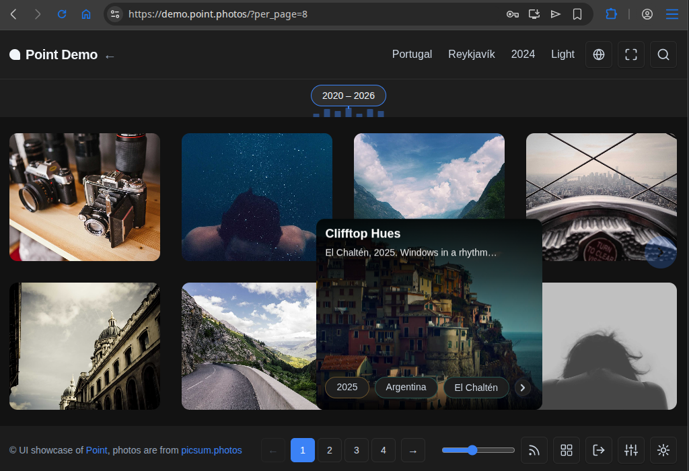

# Point

[](LICENSE)
[](https://github.com/dariy/point/actions/workflows/test.yml)
[](https://github.com/dariy/point/pkgs/container/point)

A personal photo blog engine.

Single container, SQLite storage. Built with Go + Echo v4 backend and a plain JS SPA frontend.



## Quick start

```bash
curl -fsSL https://raw.githubusercontent.com/dariy/point/main/quickstart/install.sh | bash
```

The wizard asks a few questions (sensible defaults — just hit Enter should be fine) and has Point running in minutes. Supports Docker, Podman, and native Linux binary installs.

For manual steps, environment variables, and update instructions see [QUICKSTART.md](QUICKSTART.md).

## Key features

- **Single container**: multi-stage Dockerfile, runs as non-root, multi-arch (amd64 + arm64) GHCR images
- **Media-centric**: automatic thumbnail generation, image resizing, video support, EXIF extraction
- **Instagram cross-posting**: publish photos to Instagram Business/Creator accounts automatically on publish or on demand (BYO Meta app credentials)
- **Timeline navigation**: interactive timeline with tag-based filtering and year/location drill-down
- **Geo-tags**: each tag can be bound to world coordinates.
- **Map**: highlights all geo-tags on a world map. Thanks to [leaflet](https://leafletjs.com).
- **Comments**: optional built-in [remark42](https://remark42.com) engine — widget under every post, moderation inside the Point admin, anonymous or OAuth commenting
- **Post scheduling**: publish posts at a future date/time
- **Immersive mode**: full-screen, distraction-free viewing

[Full feature list](docs/features.md)

## Configuration

The app is configured via environment variables (or a `.env` file in the working directory).

| Variable | Default | Description |
|---|---|---|
| `PORT` | `8000` | API listen port |
| `APP_URL` | *(empty)* | Public URL of your blog (e.g. `https://blog.example.com`) — required for Instagram cross-posting and OAuth callbacks |
| `DATABASE_URL` | `sqlite:./data/point.db` | SQLite path |
| `STORAGE_PATH` | `./data` | Media file root |
| `GEMINI_API_KEY` | *(empty)* | Google Gemini key for AI media analysis |
| `REMARK_URL` | *(empty)* | Public URL of the comments endpoint (`<APP_URL>/comments`) — with `REMARK_SECRET`, starts the bundled remark42 engine |
| `REMARK_SECRET` | *(empty)* | JWT-signing secret for remark42 (any long random string) |
| `PHOTO_LIBRARY_PATH` | *(empty)* | Path to a read-only photo library to import from |
| `SESSION_EXPIRY_HOURS` | `720` | Auth session TTL (30 days) |
| `MAX_UPLOAD_SIZE_MB` | `50` | Upload size limit |
| `STORAGE_QUOTA_MB` | `0` | Media storage allowance the dashboard reports usage against; `0` = unlimited (no usage bar) |
| `THUMBNAIL_WIDTH/HEIGHT` | `400/300` | Thumbnail dimensions |
| `HEAD_HTML` | *(empty)* | Extra HTML injected into `<head>` at serve time (analytics, verification tags) — public shell only, never served to admin/authenticated pages |
| `CSP_SCRIPT_SRC` / `CSP_CONNECT_SRC` | *(empty)* | Extra origins appended to the Content-Security-Policy `script-src`/`connect-src` directives, for use with `HEAD_HTML` |

## Development

### Run locally

```bash
./scripts/run.sh            # build + run locally (way faster than rebuild.sh)
# runs at http://localhost:8001 (reads .env if present)
```

### Tests & CSS

```bash
./scripts/run-tests.sh          # Go tests with coverage
./scripts/run-tests.sh --race   # with race detector
./scripts/build-css.sh          # rebuild CSS bundles after editing frontend/css/
```

### Build + deploy (Podman)

```bash
./scripts/rebuild.sh        # build + restart container
```

### Prerequisites

- Go 1.26.3+ for local backend development
- Docker or Podman for container builds

## Project structure

```
api/          Go backend (Echo v4, sqlc, SQLite)
frontend/     Vanilla JS SPA (no build step for development)
build/        Dockerfile, compose file, rebuild script
scripts/      Dev scripts (run, checks, tests, CSS/JS bundling)
quickstart/   Quickstart docker-compose and install script
data/         Runtime data (DB + media) — gitignored
```

## Production deployment

[QUICKSTART.md](QUICKSTART.md) covers the full install in a few commands, using
[`quickstart/docker-compose.yml`](quickstart/docker-compose.yml) and the published
image. Pin a version tag rather than `latest` for production.

### Don't want to run it yourself?

[Point Hosting](https://point.photos/and/pizza) runs this same engine as a
managed service — servers, TLS and backups handled, your data still exportable
as one ordinary folder. It funds the engine's development. Self-hosting stays
first-class and always will; if that's what you're here for, ignore this.

## License

MIT — see [LICENSE](LICENSE).

## Built with

[Go](https://golang.org/) · [Echo](https://echo.labstack.com/) · [SQLite](https://sqlite.org/) · [Podman](https://podman.io/)

### External projects in use

- [leaflet](https://github.com/Leaflet/Leaflet) - map library for geo data representation.
- [remark42](https://github.com/umputun/remark42) - comments engine sidecar.
- [codejar](https://github.com/antonmedv/codejar) and [prismjs](https://github.com/PrismJS/prism) - highlighting in the post editor.

```
 _| _ ._oo ._  __|_
(_|(_|| ||o| |}_ | 
```
