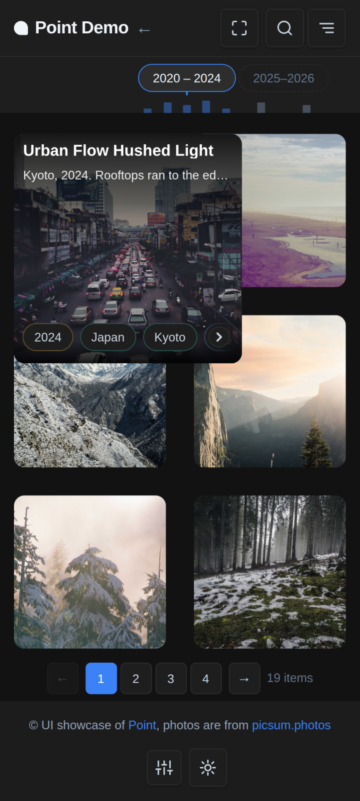
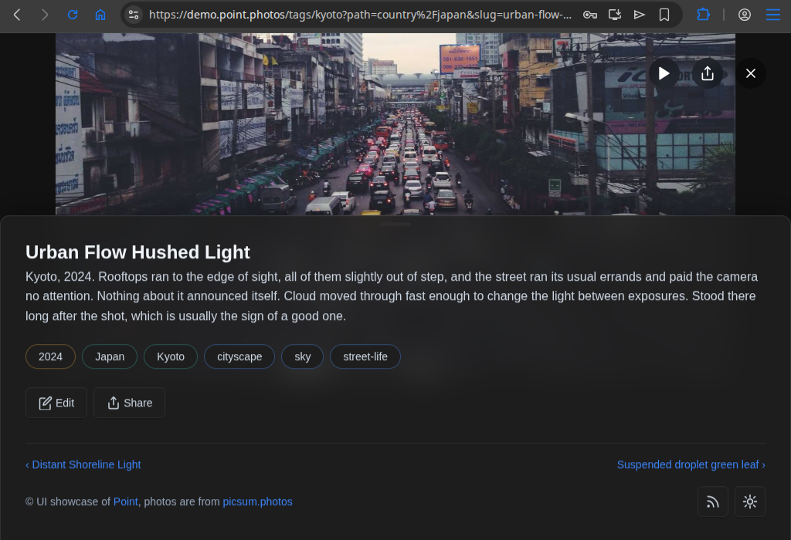
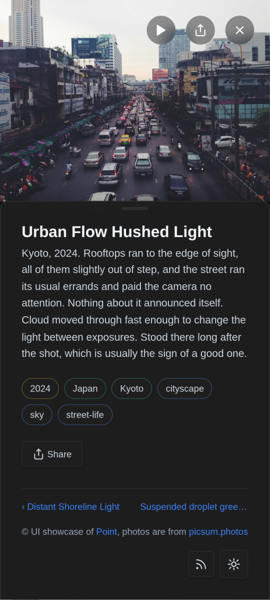

# Point

[](LICENSE)
[](https://github.com/dariy/point/actions/workflows/test.yml)
[](https://github.com/dariy/point/pkgs/container/point)

A personal photo blog engine.

Single container, SQLite storage. Built with Go + Echo v4 backend and a plain JS SPA frontend.

## Quick showcase
[UI Demo](https://demo.point.photos)

### Post list
 

### Post datails
 

## Quick start

```bash
curl -fsSL https://raw.githubusercontent.com/dariy/point/main/quickstart/install.sh | bash
```

The wizard asks a few questions (sensible defaults — just hit Enter should be fine) and has Point running in minutes. Supports Docker, Podman, and native Linux binary installs.

For manual steps, environment variables, and update instructions see [QUICKSTART.md](QUICKSTART.md).

## Key features

- **Single container**: multi-stage Dockerfile, runs as non-root, multi-arch (amd64 + arm64) GHCR images
- **Media-centric**: automatic thumbnail generation, image resizing, video support, EXIF extraction
- **MCP server**: a built-in [Model Context Protocol](https://modelcontextprotocol.io) endpoint at `/mcp` — 28 tools that let Claude or any MCP client write, tag, publish and theme the blog. Opt-in plugin, off by default ([how to connect](#manage-it-from-an-mcp-client))
- **Instagram cross-posting**: publish photos to Instagram Business/Creator accounts automatically on publish or on demand (BYO Meta app credentials)
- **Timeline navigation**: interactive timeline with tag-based filtering and year/location drill-down
- **Geo-tags**: each tag can be bound to world coordinates.
- **Map**: highlights all geo-tags on a world map. Thanks to [leaflet](https://leafletjs.com).
- **Comments**: optional built-in [remark42](https://remark42.com) engine — widget under every post, moderation inside the Point admin, anonymous or OAuth commenting
- **Post scheduling**: publish posts at a future date/time
- **Immersive mode**: full-screen, distraction-free viewing

[Full feature list](docs/features.md)

## Manage it from an MCP client

Point speaks the [Model Context Protocol](https://modelcontextprotocol.io) itself — the server runs
in-process, so there is no sidecar and nothing extra to deploy. Enable the **MCP** plugin from
`/light/plugins` (it ships off: a remote control over the whole blog is something you switch on
deliberately) and point a client at `https://your-blog.example.com/mcp`, the streamable-HTTP
transport.

A connected client gets **28 tools** covering posts (create, update, publish, withdraw, delete,
replace text in a body, set tags, generate a preview link), tags (CRUD plus geocoding), media (list,
upload, AI analysis), themes, settings and analytics — plus three read-only resources and a
`create_landing_page` prompt. Tool calls dispatch to the very same REST handlers the web UI calls,
so MCP obeys exactly the API's validation and business rules rather than a parallel implementation
of them.

Two ways to authenticate, both resolving to the same single admin identity as every other surface:

- **An API key** as `Authorization: Bearer …` — the simple path for a local or scripted client.
  Create one in the API Keys panel on `/light/plugins`.
- **OAuth 2.1**, for remote clients that connect by URL (Claude web and desktop). The engine ships
  its own provider — discovery, dynamic client registration, authorize, token — and the login
  validates your real admin password; there is no separate MCP credential. Set `MCP_BASE_URL` if
  your public HTTPS base differs from `APP_URL`, since that is what discovery advertises.

One thing to expect: `point_upload_media` reads paths on the **server**, sandboxed to
`PHOTO_LIBRARY_PATH` — not files on the machine running the client. With the plugin disabled, `/mcp`
and the OAuth discovery routes 404. Full tool list and design notes:
[docs/features/mcp.md](docs/features/mcp.md).

## Configuration

The app is configured via environment variables (or a `.env` file in the working directory).

| Variable | Default | Description |
|---|---|---|
| `PORT` | `8000` | API listen port |
| `APP_URL` | *(empty)* | Public URL of your blog (e.g. `https://blog.example.com`) — required for Instagram cross-posting and OAuth callbacks |
| `DATABASE_URL` | `sqlite:./data/point.db` | SQLite path |
| `STORAGE_PATH` | `./data` | Media file root |
| `GEMINI_API_KEY` | *(empty)* | Google Gemini key for AI media analysis |
| `MCP_BASE_URL` | *(empty)* | Public HTTPS base the MCP server advertises in its OAuth discovery metadata — falls back to `APP_URL` |
| `REMARK_URL` | *(empty)* | Public URL of the comments endpoint (`<APP_URL>/comments`) — with `REMARK_SECRET`, starts the bundled remark42 engine |
| `REMARK_SECRET` | *(empty)* | JWT-signing secret for remark42 (any long random string) |
| `PHOTO_LIBRARY_PATH` | *(empty)* | Path to a read-only photo library to import from |
| `SESSION_EXPIRY_HOURS` | `720` | Auth session TTL (30 days) |
| `MAX_UPLOAD_SIZE_MB` | `50` | Upload size limit |
| `STORAGE_QUOTA_MB` | `0` | Media storage allowance the dashboard reports usage against; `0` = unlimited (no usage bar) |
| `PAGE_CACHE_BUDGET_MB` | `64` | Size ceiling for the rendered-page cache (`<STORAGE_PATH>/cache`); oldest entries are evicted first once it is passed, `0` = no eviction |
| `HEAD_HTML` | *(empty)* | Extra HTML injected into `<head>` at serve time (analytics, verification tags) — public shell only, never served to admin/authenticated pages |
| `CSP_SCRIPT_SRC` / `CSP_CONNECT_SRC` | *(empty)* | Extra origins appended to the Content-Security-Policy `script-src`/`connect-src` directives, for use with `HEAD_HTML` |

## Development

### Run locally

```bash
./scripts/run.sh            # build + run locally (way faster than rebuild.sh)
# runs at http://localhost:8001 (reads .env if present)
```

### Tests & CSS

```bash
./scripts/run-tests.sh          # Go tests with coverage
./scripts/run-tests.sh --race   # with race detector
./scripts/build-css.sh          # rebuild CSS bundles after editing frontend/css/
```

### Build + deploy (Podman)

```bash
./scripts/rebuild.sh        # build + restart container
```

### Prerequisites

- Go 1.26.6+ (the version in `api/go.mod`) for local backend development
- Node 22+ for the frontend bundles — `scripts/run.sh` installs the npm dev
  dependencies itself on first run
- Docker or Podman for container builds

`./scripts/doctor.sh` checks all of the above against your machine — versions, the tools
`./scripts/check.sh` needs, port 8001, and whether `data/` is writable — and prints the install
line for anything missing (`--json` for machine use).

Contributors: see [CONTRIBUTING.md](CONTRIBUTING.md) for the change loop, and
[AGENTS.md](AGENTS.md) for the project's conventions and a map of where things live.

### Contributing with a coding agent

Welcome, and planned for. That is why `AGENTS.md` is committed rather than kept private: your agent
starts from this project's real conventions — the generated files it must not edit, the test build
tags, the plugin gating — instead of inferring them. Around it, `./scripts/doctor.sh --json` reports
the environment machine-readably, `./scripts/check.sh` is the entire CI gate in one command, and the
`playwright-cli` skill in `.claude/skills/` ships in the repo so an agent can open the page and look
at what it changed ([the recipe](docs/testing.md#verifying-a-ui-change)).

The bar for the resulting PR is the same as any other: the tests pass, the change is verified, and
you understand and stand behind the diff.

How this repository was itself built is stated in [ai-declaration.md](ai-declaration.md) —
provenance by category and level, with a floor that is countable from the commit history.

## Project structure

```
api/          Go backend (Echo v4, sqlc, SQLite)
frontend/     Vanilla JS SPA (no framework; esbuild bundles src/ into js/)
build/        Dockerfile, compose file, rebuild script
scripts/      Dev scripts (run, checks, tests, CSS/JS bundling)
quickstart/   Quickstart docker-compose and install script
data/         Runtime data (DB + media) — gitignored
```

## Production deployment

[QUICKSTART.md](QUICKSTART.md) covers the full install in a few commands, using
[`quickstart/docker-compose.yml`](quickstart/docker-compose.yml) and the published
image. Pin a version tag rather than `latest` for production.

## License

MIT — see [LICENSE](LICENSE).

## Built with

[Go](https://golang.org/) · [Echo](https://echo.labstack.com/) · [SQLite](https://sqlite.org/) · [Podman](https://podman.io/)

### External projects in use

- [leaflet](https://github.com/Leaflet/Leaflet) - map library for geo data representation.
- [remark42](https://github.com/umputun/remark42) - comments engine sidecar.
- [codejar](https://github.com/antonmedv/codejar) and [prismjs](https://github.com/PrismJS/prism) - highlighting in the post editor.

```
 _| _ ._oo ._  __|_
(_|(_|| ||o| |}_ | 
```
