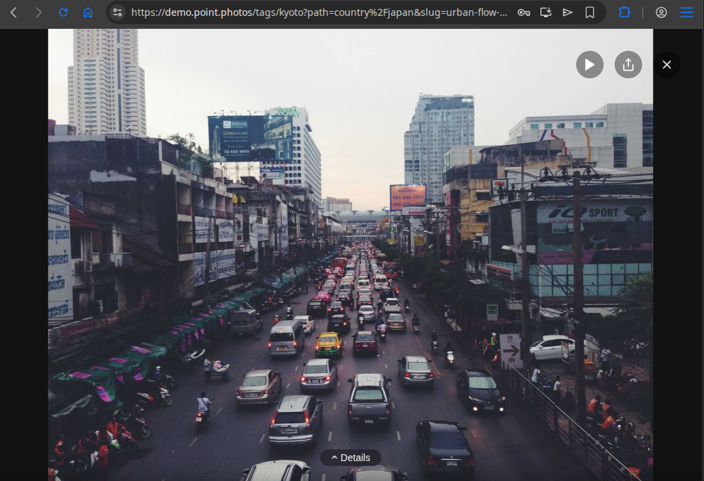
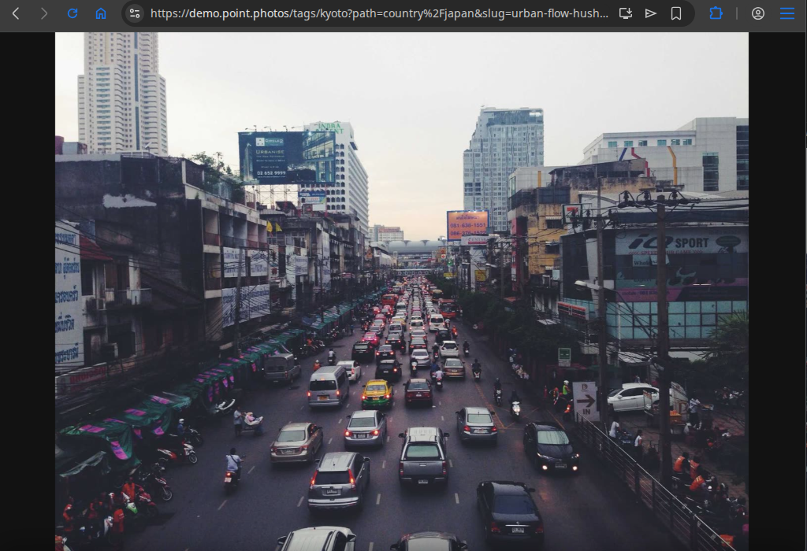
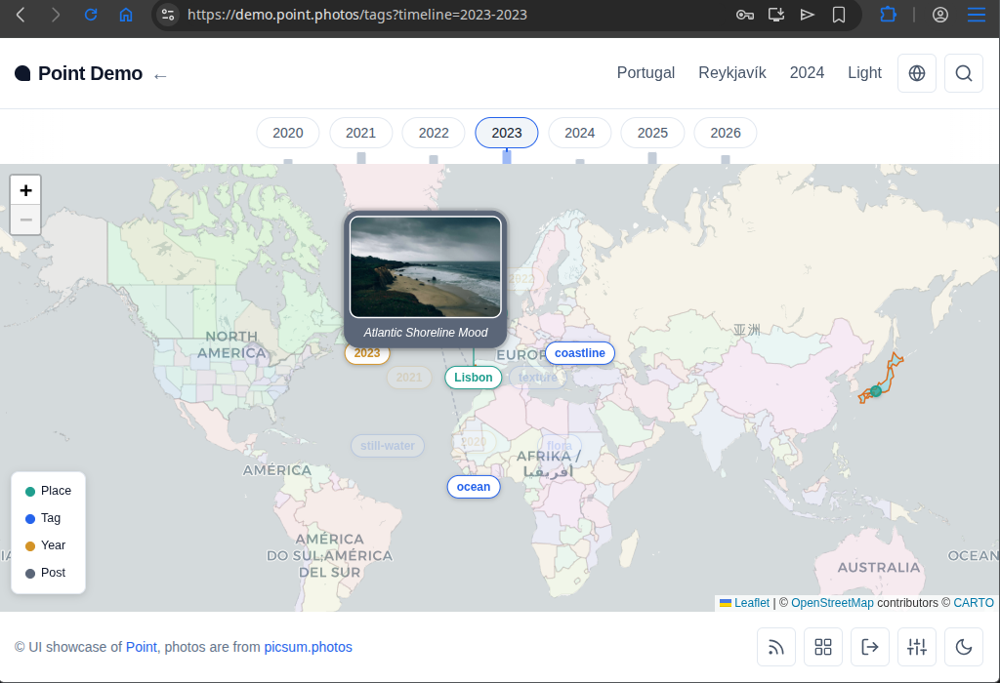
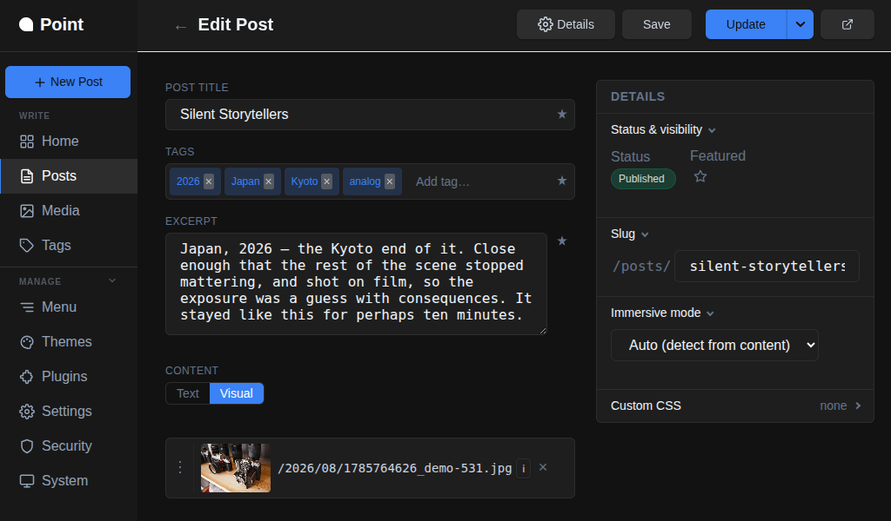
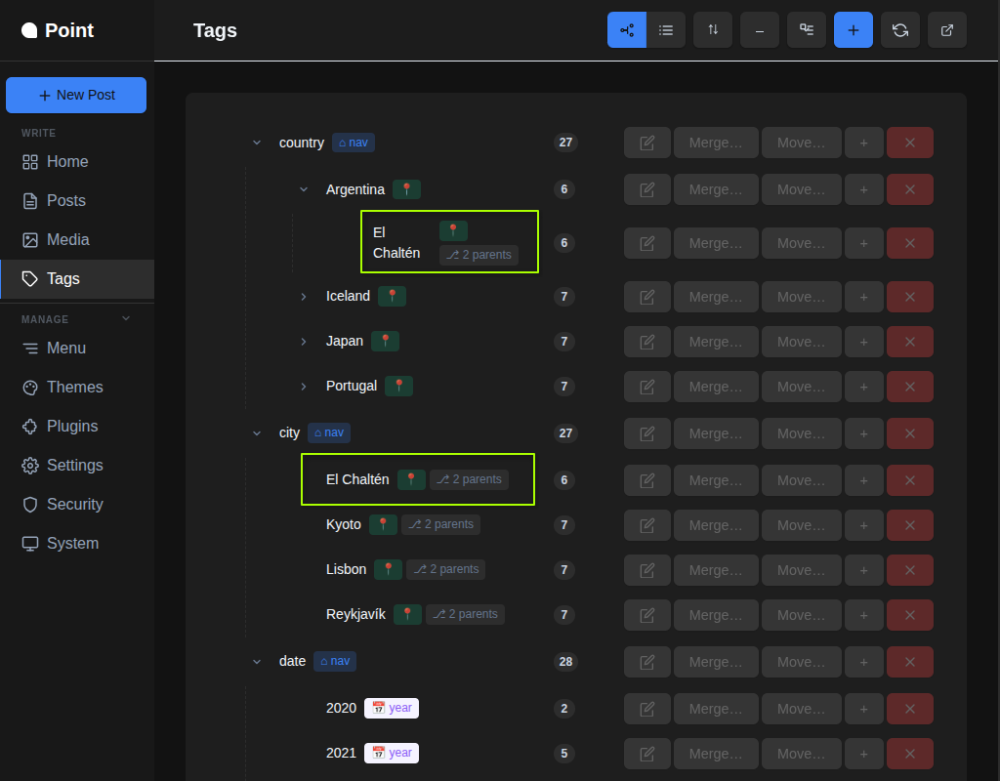
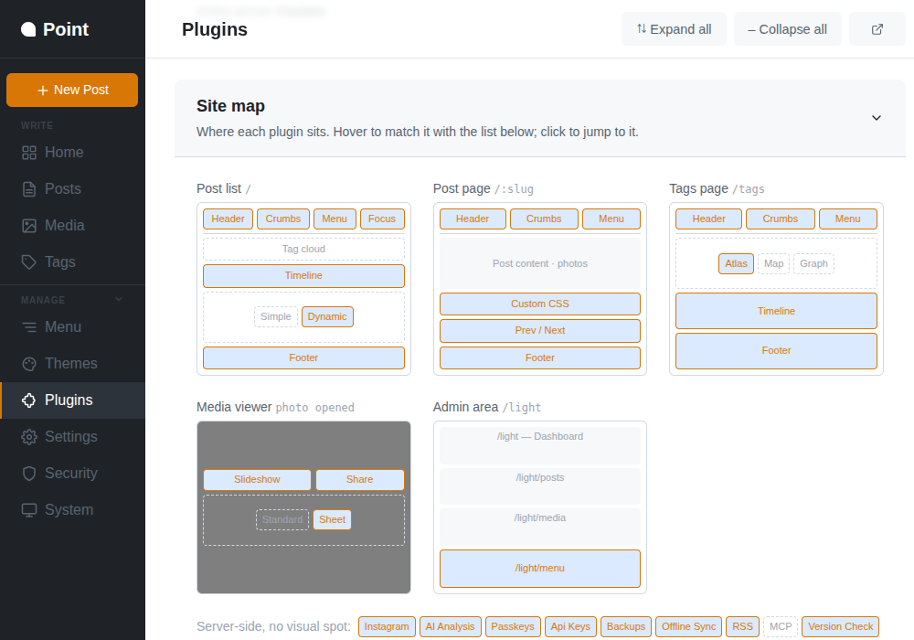
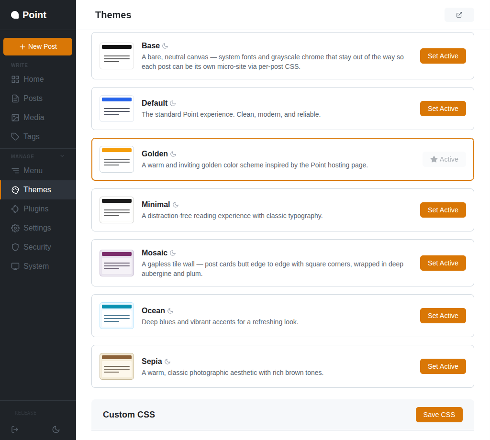
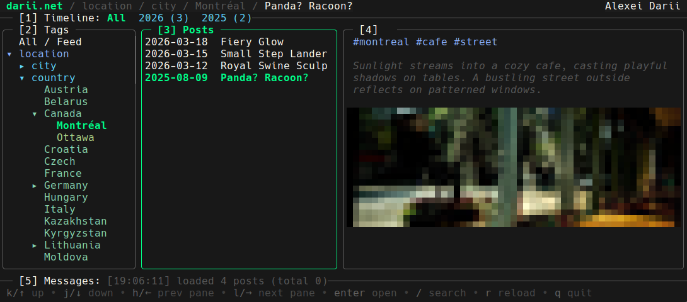

# Showcase
This is brief visual showcase of the UI. There is playable [UI demo](https://demo.point.photos).

# Public part
## Post list
 

## Post page
 

## Post page — details
 

## Map

# Admin part
## Posts

## Tags

## Plugins

## Themes

# Bonus: TUI
[Point TUI](https://github.com/dariy/point-tui)

